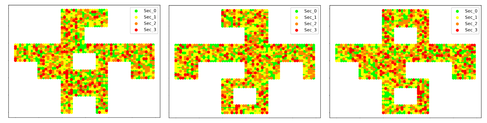

# multisensor-deployment

This repository contains the code for the paper "*Evolutionary optimization of spatially-distributed multi-sensors placement for indoor surveillance environments with security levels*". In this paper, our goal is to optimize the placement of sensors (smoke detectors, cameras, seismic detectors, etc) in a surveillance environment; to achieve this, we employ evolutionary meta-heuristics.

## How to run

## Citing the paper
