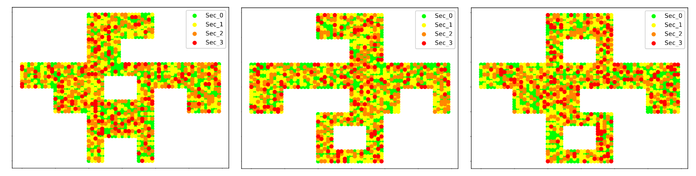

# multisensor-deployment

This repository contains the code for the paper "*Evolutionary optimization of spatially-distributed multi-sensors placement for indoor surveillance environments with security levels*", by Luis M. Moreno-Saavedra, Vinícius G. Costa, Adrián Garrido-Sáez, Silvia Jiménez-Fernández, J. Antonio Portilla-Figueras, and Sancho Salcedo-Sanz. 

In this paper, our goal is to optimize the placement of sensors (smoke detectors, cameras, seismic detectors, etc) in a surveillance environment, simultaneously covering all surveillance requirements and minimizing the total cost of purchased sensors. To achieve this, we employ evolutionary meta-heuristics with a novel encoding (integer encoding with binary conversion), and compare it with other approaches from the literature.

## How to run

To reproduce the paper's results, simply:

```bash
git clone https://github.com/LuisMiguelMoreno/multisensor-deployment
cd multisensor-deployment
pip install -r requirements.txt
```

Each experiment can be reproduced by running its corresponding script. The scripts are contained in the `experiments` folder and can be run as follows:

```bash
python experiments/Experiment_2_EA.py
python experiments/Experiment_2_GRASP.py
python experiments/Experiment_2_EA+RA.py
python experiments/Experiment_2_RA.py
```

## Citing the paper

To cite the paper, please use the following BibTeX entry:

```bibtex
[to do]
```
